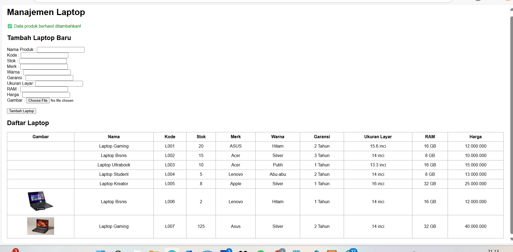

Saya Fauzia Rahma Nisa mengerjakan Tugas Praktikum 2 dalam mata kuliah Desain dan Pemrograman Berdasarkan Objek untuk keberkahanNya maka saya tidak melakukan kecurangan seperti yang telah dispesifikasikan. Aamiin.

A. PENJELASAN CLASS ATRIBUT DAN ATRIBUT

- ClassProduk (Parent paling dasar)
Atribut : nama, kode, stok
Atribut-atribut ini adalah data fundamental yang pasti ada di semua barang, apapun jenis dan kategorinya. Dengan menaruh atribut ini di kelas dasar, semua turunan otomatis memiliki identitas dasar produk yang lengkap.

- ClassElektronik (Turunan dari produk)
Atribut  : merk, warna, garansi
kenapa aku simpan 3 atribut itu disini Ketiga atribut ini adalah atribut yang umumnya dimiliki produk.

      merk     : masih bisa di produk umum, tapi ditaruh disini supaya lebih fokus ke barang elektronik.
      
      warna    : relevan buat elektronik karena pasti setiap barang elektronik itu memiliki variasi warna.
      
      garansi  : atribut yang sangat khas pada produk elektronik, karena hampir semua elektronik diberikan garansi.

- Classlaptop (Chill terakhir, turunan dari eletronik)
Atribut  : ukuranLayar, RAM, harga
knpa aku simpan 3 atribut tersebut di class laptop? karna Ketiga atribut ini adalah atribut khusus laptop yang tidak relevan untuk semua produk elektronik lain.

      ukuranLayar : hanya relevan pada perangkat seperti laptop, tidak pada kipas angin, kulkas, mesin cuci, dll.
      
      RAM         : khas pada laptop.
      
      harga       : sebenarnya bisa aja diletakkan di kelas Produk karena semua barang memiliki harga. tapi karena fokus saat ini adalah pada laptop, atribut ini aku letakin di kelas Laptop.

Dengan desain seperti ini, ketika kita membuat objek Laptop, maka objek tersebut otomatis memiliki seluruh atribut yang diturunkan dari Produk dan Elektronik, sehingga data yang tersimpan lebih lengkap dan sesuai dengan dunia nyata.

B. PENJELASAN METHOD
1. Getter & Setter
   Untuk mengakses (get) dan mengubah (set) nilai atribut dengan cara yang aman. Dengan Getter & Setter, perubahan data bisa dikontrol.
2. cetakTabel
   Method ini menampilkan daftar laptop dalam bentuk tabel. Method ini melakukan iterasi terhadap list/array yang berisi objek Laptop. Setiap objek dipanggil Getter-nya untuk menampilkan data lengkap: nama, kode, stok, merk, warna, garansi, ukuran layar, RAM, harga, dan image (khusus PHP).
3. tambahLaptop
   Method ini menangani input laptop baru dari user. Method ini juga mengecek dulu apakah kodeProduk sudah ada atau belum → kalau sudah ada, data tidak ditambahkan. Kalau belum ada, data baru dimasukkan ke list/array.
   
C. DIAGRAM

D. PENJELASAN ALUR PROGRAM
1. Inisialisasi Data Awal
- Program dimulai dengan membuat 5 data laptop awal (Laptop Gaming, Bisnis, Ultrabook, Student, Kreator).
- Data ini langsung disimpan dalam vektor.
  
2. Tampilan Menu Utama
- Program menampilkan pilihan menu:
  a. Tambah Laptop
  b. Lihat Tabel Laptop
  c. Keluar

3. Proses Pilihan User
- Jika user memilih 1 (Tambah Laptop): User diminta mengisi atribut laptop baru (nama, kode, stok, merk, warna, garansi, ukuran layar, RAM, harga, image untuk PHP). Lalu program cek apakah kode produk sudah ada. Jika ada → tampil pesan error.Jika tidak ada → data laptop baru ditambahkan.

- Jika user memilih 2 (Lihat Tabel Laptop): Program menampilkan daftar laptop dalam bentuk tabel.

- Jika user memilih 3 (Keluar): Program berhenti dengan pesan “Program selesai.”

4. Looping
- Program berjalan terus (looping) sampai user memilih keluar (pilihan = 3).

E. DOKUMENTASI
- CPP
  
  
  

- JAVA
  
  
  

- PYTHON

  
  

- PHP

  
  
  
  
